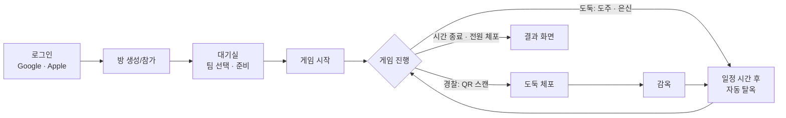
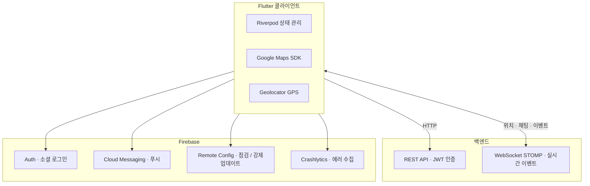

# 경찰과 도둑 (Cops and Robbers)

> 위치 기반 실시간 멀티플레이어 모바일 게임

[-orange.svg)](LICENSE)

---

## 📱 프로젝트 소개

오프라인에서 진행되던 전통적인 술래잡기 게임을 **위치 기반 기술**과 **실시간 동기화**로 디지털화한 Flutter 모바일 애플리케이션입니다.

친구·동료·가족이 야외 공간에서 스마트폰만으로 함께 즐길 수 있도록 만들었습니다. GPS·QR·실시간 채팅이 결합되어, 별도의 심판 없이도 자동으로 게임이 진행됩니다.

---

## ✨ 핵심 기능

- 🗺️ **실시간 위치 동기화** — GPS 기반 다인원 동시 추적
- 📲 **QR 체포 시스템** — 도둑 QR 표시, 경찰 QR 스캔으로 체포
- 🚪 **자동 탈옥** — 수감 후 일정 시간 경과 시 자동 복귀
- 👥 **팀별 전용 채팅** — 경찰/도둑 분리, 답장·신고·비속어 필터링
- 📍 **구역 이탈 자동 경고** — 플레이그라운드/감옥 경계 감지 + 비네트 경고
- 🎮 **자동 판정 진행** — 수동 개입 없이 규칙 기반 게임 진행
- 🔐 **소셜 로그인** — Google / Apple + JWT 자동 갱신
- 📲 **QR 초대 시스템** — QR 코드로 간편한 게임 참가
- 🔔 **푸시 알림 + 진동 피드백** — 주요 이벤트 즉시 전달
- 📚 **인게임 튜토리얼** — 카탈로그 페이지로 다시 보기 가능
- 🔧 **원격 운영 관리** — 점검 모드 / 강제 업데이트 제어

---

## 🎮 게임 플로우

---

## 🏗️ 시스템 구조

---

## 🛠️ 기술 스택

- **Flutter / Dart** — 크로스 플랫폼 앱
- **Riverpod + Freezed** — 선언적 상태 관리 / 불변 데이터 모델
- **Retrofit + Dio** — REST API 클라이언트
- **STOMP over WebSocket** — 실시간 위치·채팅·이벤트 동기화
- **Google Maps SDK + Geolocator** — 지도 표시 및 GPS 추적
- **Firebase** — Auth · FCM · Remote Config · Crashlytics
- **QR Flutter + Mobile Scanner** — 체포 시스템

---

## 📝 라이선스

이 프로젝트는 **Cops and Robbers Source Available License v1.0** 하에 배포됩니다. 해당 라이선스는 [Elastic License 2.0 (ELv2)](https://www.elastic.co/licensing/elastic-license)를 기반으로 작성되었습니다.

- ✅ **소스 열람** — 학습 · 참고 목적의 코드 열람을 허용합니다
- ❌ **[상업적 사용 제한](LICENSE)** — 상업적 호스팅 · 재배포 · 본 서비스와 경쟁하는 형태의 사용은 허용하지 않습니다

자세한 내용은 [LICENSE](LICENSE) 파일을 참고하세요.

---

## 📧 연락처

- **이슈 제보**: [GitHub Issues](https://github.com/cops-and-robbers/cops-and-robbers-FE/issues)

---

<!-- AUTO-VERSION-SECTION: DO NOT EDIT MANUALLY -->
<!-- 이 섹션은 .github/workflows/PROJECT-README-VERSION-UPDATE.yaml에 의해 자동으로 업데이트됩니다 -->
<!-- 수정하지마세요 자동으로 동기화 됩니다 -->
<!-- AUTO-VERSION-SECTION: DO NOT EDIT MANUALLY -->
## 최신 버전 : v2.2.9 (2026-06-17)

[전체 버전 기록 보기](CHANGELOG.md)
<!-- END-AUTO-VERSION-SECTION -->

---

**Built with ❤️ by Development Team**
