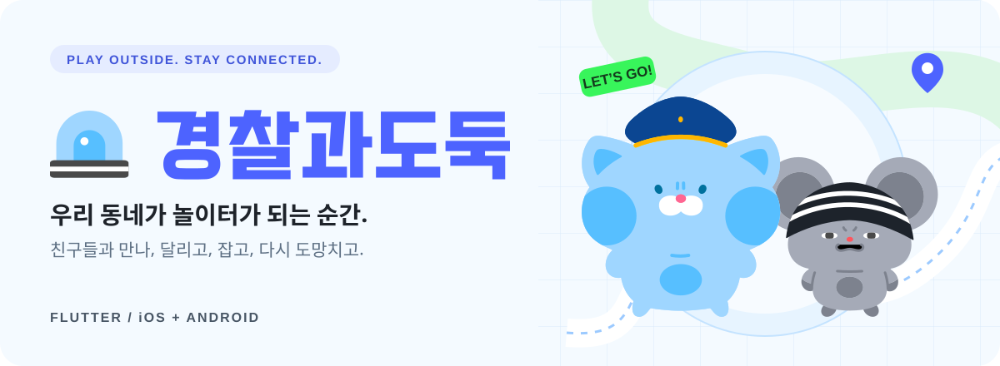
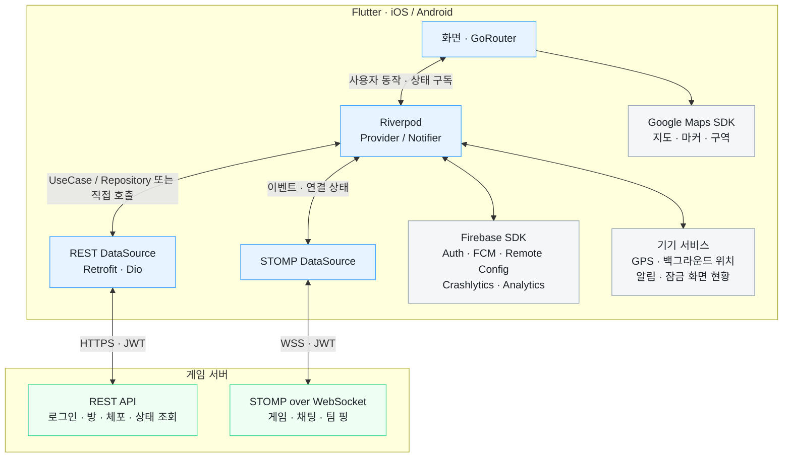
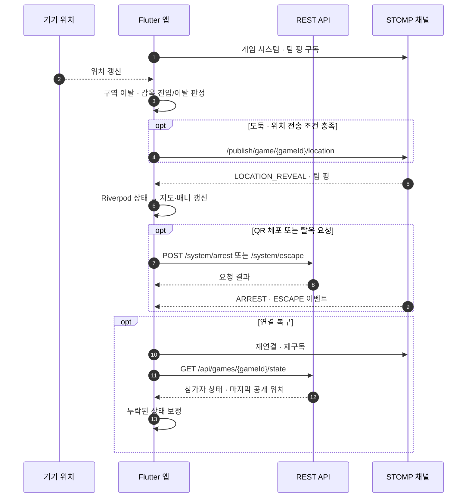

<p align="center">
  
</p>

<h1 align="center">경찰과 도둑 · Cops and Robbers</h1>

<p align="center">
  <strong>스마트폰을 들고, 다시 밖에서 만나요.</strong><br />
  지도 위에서 친구를 찾고, QR로 체포하고, 팀 채팅으로 작전을 나누는 야외 멀티플레이 게임.
</p>

<p align="center">
  <a href="https://copsandrobbers.app">공식 사이트</a> ·
  <a href="https://apps.apple.com/us/app/id6756843948">App Store</a> ·
  <a href="https://play.google.com/store/apps/details?id=com.elipair.copsandrobbers">Google Play</a> ·
  <a href="https://github.com/cops-and-robbers/cops-and-robbers-FE/issues">이슈 제보</a>
</p>

<p align="center">
  
  
  
  
</p>

<p align="center">
  <a href="#play">게임 경험</a> · <a href="#architecture">아키텍처</a> ·
  <a href="#realtime">실시간 흐름</a> · <a href="#getting-started">로컬 실행</a> ·
  <a href="#guide">코드 가이드</a>
</p>

---

<a id="play"></a>

## 밖에서 만나고, 앱으로 연결하고

**경찰과 도둑**은 오프라인 술래잡기에 지도·위치 공유·실시간 게임 상태를 더한 Flutter 앱입니다. 경찰은 도둑을 찾아 QR로 체포하고, 도둑은 도망치거나 감옥에서 탈출하며 게임을 이어갑니다.

| 🗺️ 지도 위 추격전 | 📲 만나서 체포, 움직여서 탈옥 |
| :--- | :--- |
| 플레이그라운드·감옥을 설정하고, 공개 주기에 맞춰 도둑의 위치를 확인합니다. 팀 핑과 구역 이탈 경고가 함께 동작합니다. | 경찰이 도둑의 QR을 스캔해 체포합니다. 일반 게임에서는 수감된 도둑의 감옥 진입·이탈을 GPS로 감지해 탈옥을 요청합니다. |
| **💬 게임 안팎의 대화** | **🏃 함께할 사람부터 오늘의 기록까지** |
| 인게임 팀 채팅으로 작전을 나누고, 커뮤니티 모집글과 채팅으로 함께할 사람을 만납니다. | 초대 링크·코드·QR로 참가하고, 게임이 끝나면 결과와 이동 경로·거리를 담은 기록을 공유합니다. |

Google·Apple 로그인, 한국어·영어·일본어, 역할별 화면 테마를 지원합니다. 백그라운드 위치 추적과 잠금 화면 게임 현황은 플랫폼별 네이티브 기능으로 연결합니다.

### 한 판의 흐름


```mermaid
flowchart LR
    A["로그인 · 홈"] --> B["방 생성 / 초대 참가"]
    B --> C["대기실<br/>팀 선택 · 준비"]
    C --> D["추격전<br/>위치 공개 · QR 체포 · 탈옥"]
    D --> E["게임 결과<br/>기록 공유"]
    classDef blue fill:#E7F4FF,stroke:#339DFF,color:#1E232A;
    classDef green fill:#EFFEF2,stroke:#33D890,color:#1E232A;
    class A,B,C blue;
    class D,E green;
```

<a id="architecture"></a>

## 앱은 이렇게 연결됩니다

Flutter가 화면과 상태를 맡고, **REST는 조회·명령**, **STOMP는 실시간 이벤트**를 담당합니다. Firebase는 인증·푸시·운영 기능을, 네이티브 코드는 백그라운드 작업과 OS 표시면을 연결합니다.


```mermaid
flowchart TB
    subgraph APP["Flutter · iOS / Android"]
        UI["화면 · GoRouter"]
        STATE["Riverpod<br/>Provider / Notifier"]
        HTTP["REST DataSource<br/>Retrofit · Dio"]
        WS["STOMP DataSource"]
        FIREBASE["Firebase SDK<br/>Auth · FCM · Remote Config<br/>Crashlytics · Analytics"]
        MAP["Google Maps SDK<br/>지도 · 마커 · 구역"]
        DEVICE["기기 서비스<br/>GPS · 백그라운드 위치<br/>알림 · 잠금 화면 현황"]
        UI <-->|"사용자 동작 · 상태 구독"| STATE
        UI --> MAP
        STATE <-->|"UseCase / Repository 또는 직접 호출"| HTTP
        STATE <-->|"이벤트 · 연결 상태"| WS
        STATE <--> FIREBASE
        STATE <--> DEVICE
    end
    subgraph SERVER["게임 서버"]
        API["REST API<br/>로그인 · 방 · 체포 · 상태 조회"]
        SOCKET["STOMP over WebSocket<br/>게임 · 채팅 · 팀 핑"]
    end
    HTTP <-->|"HTTPS · JWT"| API
    WS <-->|"WSS · JWT"| SOCKET
    classDef blue fill:#E7F4FF,stroke:#339DFF,color:#1E232A;
    classDef green fill:#EFFEF2,stroke:#33D890,color:#1E232A;
    classDef gray fill:#F4F6F8,stroke:#93A2B3,color:#1E232A;
    class UI,STATE,HTTP,WS blue;
    class API,SOCKET green;
    class FIREBASE,MAP,DEVICE gray;
```

### 코드의 경계

기능별로 폴더를 나누는 **Feature-first** 구조에 `presentation / domain / data` 계층을 둡니다. Riverpod provider가 구현체와 의존성을 조립하며, 기능에 따라 UseCase·Repository를 거치거나 DataSource를 직접 호출합니다.

| 계층 | 책임 | 코드에서 보기 |
| :--- | :--- | :--- |
| **Presentation** | 페이지·위젯, 사용자 동작, 비동기 상태 | [세션 Provider](lib/features/session/presentation/providers/session_provider.dart) |
| **Domain** | 엔티티, Repository 계약, 유스케이스와 게임 규칙 | [초대 참가 유스케이스](lib/features/session/domain/usecases/join_game_by_invite_usecase.dart) · [감옥 이탈 판정](lib/features/game/domain/jail_escape_detector.dart) |
| **Data** | Repository 구현, REST·STOMP 통신, 모델 변환 | [인증 Repository](lib/features/auth/data/repositories/auth_repository_impl.dart) · [게임 이벤트 DataSource](lib/features/game/data/datasources/game_event_stomp_datasource.dart) |
| **Core** | 공용 네트워크·저장소·디자인 시스템·기기 서비스 | [Dio 클라이언트](lib/core/network/dio_client.dart) · [백그라운드 서비스](lib/core/services/background/background_service.dart) |

인증은 **Google / Apple → Firebase ID Token → 백엔드 JWT 발급 → Secure Storage 저장** 순서입니다. 이후 REST 요청에는 공용 Dio 인터셉터가 토큰을 붙이고, 필요할 때 재발급합니다.

<a id="realtime"></a>

## 실시간 게임 데이터의 흐름

도둑의 GPS 좌표를 서버로 보내는 것과, 다른 참가자에게 위치를 공개하는 것은 별도 흐름입니다. 앱은 서버의 `LOCATION_REVEAL` 이벤트로 공개된 위치를 반영합니다.


```mermaid
sequenceDiagram
    autonumber
    participant GPS as 기기 위치
    participant APP as Flutter 앱
    participant REST as REST API
    participant WS as STOMP 채널

    APP->>WS: 게임 시스템 · 팀 핑 구독
    GPS-->>APP: 위치 갱신
    APP->>APP: 구역 이탈 · 감옥 진입/이탈 판정
    opt 도둑 · 위치 전송 조건 충족
        APP->>WS: /publish/game/{gameId}/location
    end
    WS-->>APP: LOCATION_REVEAL · 팀 핑
    APP->>APP: Riverpod 상태 → 지도·배너 갱신

    opt QR 체포 또는 탈옥 요청
        APP->>REST: POST /system/arrest 또는 /system/escape
        REST-->>APP: 요청 결과
        WS-->>APP: ARREST · ESCAPE 이벤트
    end

    opt 연결 복구
        APP->>WS: 재연결 · 재구독
        APP->>REST: GET /api/games/{gameId}/state
        REST-->>APP: 참가자 상태 · 마지막 공개 위치
        APP->>APP: 누락된 상태 보정
    end
```

- **위치 전송:** 일반 GPS 스트림에서는 미수감 도둑이 연결된 상태에서, 마지막 전송 후 5초 이상·10m 이상 이동했을 때 전송합니다. 최초 전송·즉시 전송 경로는 별도로 둡니다.
- **게임 상태:** 체포·탈옥·종료 이벤트를 Provider에 반영하고, 연결 복구 시 REST 스냅샷으로 놓친 상태를 보정합니다.
- **소켓 수명:** 로비·인게임 채팅·게임 이벤트·커뮤니티 채팅은 각자의 DataSource가 연결을 관리합니다. 커뮤니티 채팅 연결은 로그인 수명에 맞춰 유지합니다.

구현 진입점: [GamePage](lib/features/game/presentation/pages/game_page.dart) · [GameEventNotifier](lib/features/game/presentation/providers/game_event_provider.dart) · [위치 전송 정책](lib/features/game/domain/location_send_policy.dart)

<a id="getting-started"></a>

## 로컬에서 실행하기

**Flutter 3.35.5**를 CI·배포 기준으로 사용하며, Dart SDK 제약은 **`^3.9.2`**입니다. Android SDK 또는 Xcode·CocoaPods와 실행할 기기/시뮬레이터가 필요합니다.

### 1. 저장소와 환경 변수 준비

```bash
git clone https://github.com/cops-and-robbers/cops-and-robbers-FE.git
cd cops-and-robbers-FE
cp .env.example .env
```

`.env`의 `API_BASE_URL`과 `WS_URL`을 실행할 백엔드에 맞춥니다. 실기기에서는 개발 PC의 `localhost` 대신 기기에서 접근 가능한 주소를 사용합니다.

### 2. 플랫폼 설정

| 설정 | 위치 / 방법 |
| :--- | :--- |
| Android Firebase | 프로젝트에 맞는 `android/app/google-services.json` 준비 |
| iOS Firebase | 프로젝트에 맞는 `ios/Runner/GoogleService-Info.plist` 준비 |
| Android Google Maps | `android/local.properties`에 `GOOGLE_MAPS_API_KEY` 설정 |
| iOS Google Maps | `ios/Flutter/Secrets.xcconfig.example`을 `Secrets.xcconfig`로 복사해 키 설정 |

`.env`에만 지도 키를 넣어서는 네이티브 SDK에 전달되지 않습니다. 위 플랫폼별 설정도 필요합니다. 소셜 로그인·푸시를 확인하려면 해당 Firebase 프로젝트와 앱 식별자 설정이 맞아야 합니다.

### 3. 의존성·코드 생성 후 실행

```bash
flutter pub get
dart run build_runner build --delete-conflicting-outputs
flutter gen-l10n
flutter run
```

### 4. 변경 사항 검증

```bash
flutter test
flutter analyze
```

생성 파일(`*.g.dart`, `*.freezed.dart`, `app_localizations*.dart`)은 직접 수정하지 않습니다. `@riverpod`·`@freezed`·`@RestApi`·`@JsonSerializable` 변경 시 코드 생성을, `lib/l10n/app_*.arb` 변경 시 `flutter gen-l10n`을 실행합니다.

<a id="guide"></a>

## 코드 둘러보기

```text
lib/
├── main.dart              # 환경·Firebase·알림 초기화, ProviderScope
├── router/                # GoRouter, 홈·커뮤니티·마이페이지 탭, 진입 가드
├── core/                  # 네트워크, 저장소, 공용 UI, 기기 서비스
├── features/
│   ├── auth/              # 소셜 로그인, 스플래시, 약관 진입
│   ├── session/           # 방 생성·참가, 구역 설정, 대기실
│   ├── lobby/             # 대기실 실시간 이벤트
│   ├── game/              # 지도, 체포·탈옥, 위치 공개, 게임 결과
│   ├── chat/              # 인게임 팀 채팅
│   ├── community/         # 모집글, 댓글·반응, 커뮤니티 채팅
│   ├── user/ · mypage/     # 계정·프로필, 마이페이지
│   └── notice/ · report/ · bug/ · credits/
└── l10n/                  # 한국어·영어·일본어 ARB
```

| 기술 | 역할 |
| :--- | :--- |
| **Flutter · Dart · GoRouter** | 크로스 플랫폼 화면과 라우팅 |
| **Riverpod · Freezed** | 상태·의존성 관리, 불변 모델 |
| **Retrofit · Dio · STOMP** | REST 요청, 인증 인터셉터, 실시간 통신 |
| **Google Maps · Geolocator** | 지도와 위치 수신 |
| **Firebase** | 소셜 인증, 푸시, 원격 설정, 오류 수집, 사용 지표 |
| **QR Flutter · Mobile Scanner** | QR 생성·스캔 |
| **MethodChannel · Kotlin · Swift** | 백그라운드 위치, 잠금 화면 현황, 앱 아이콘 |

### 작업별 진입점

| 하려는 일 | 먼저 볼 곳 |
| :--- | :--- |
| 화면·라우트 추가 | [앱 라우터](lib/router/app_router.dart) · [라우트 경로](lib/router/route_paths.dart) |
| API 연동·인증 처리 | [Dio 설정](lib/core/network/dio_client.dart) · [토큰 인터셉터](lib/core/network/auth_interceptor.dart) |
| 실시간 게임 이벤트 수정 | [게임 이벤트 Provider](lib/features/game/presentation/providers/game_event_provider.dart) · [STOMP 공통 기반](lib/core/network/websocket/base_stomp_datasource.dart) |
| 공용 UI·팀 테마 수정 | [색상](lib/core/constants/app_colors.dart) · [역할 테마](lib/core/theme/role_theme_provider.dart) |
| 문구·번역 추가 | [한국어 ARB](lib/l10n/app_ko.arb) · [도메인 용어집](docs/i18n/glossary.md) |
| 기여 전 규칙 확인 | [개발 규칙](AGENTS.md) · [테스트 규칙](.claude/rules/Agents.md) |

함께 보기: [딥링크](docs/DEEPLINK.md) · [핑](docs/Ping_spec.md) · [이벤트 게임](docs/EVENT_GAME_spec.md) · [변경 기록](CHANGELOG.md)

---

<!-- AUTO-VERSION-SECTION: DO NOT EDIT MANUALLY -->
<!-- 이 섹션은 .github/workflows/PROJECT-README-VERSION-UPDATE.yaml에 의해 자동으로 업데이트됩니다 -->
<!-- 수정하지마세요 자동으로 동기화 됩니다 -->
<!-- AUTO-VERSION-SECTION: DO NOT EDIT MANUALLY -->
## 최신 버전 : v3.1.24 (2026-10-01)

[전체 버전 기록 보기](CHANGELOG.md)
<!-- END-AUTO-VERSION-SECTION -->

## 라이선스

이 저장소는 **Cops and Robbers Source-Available License v1.5**를 따릅니다. 사용 조건과 제한은 [LICENSE](LICENSE)를 확인해 주세요.

<p align="center">밖에서 다시 만나요. 👮 🐭</p>
