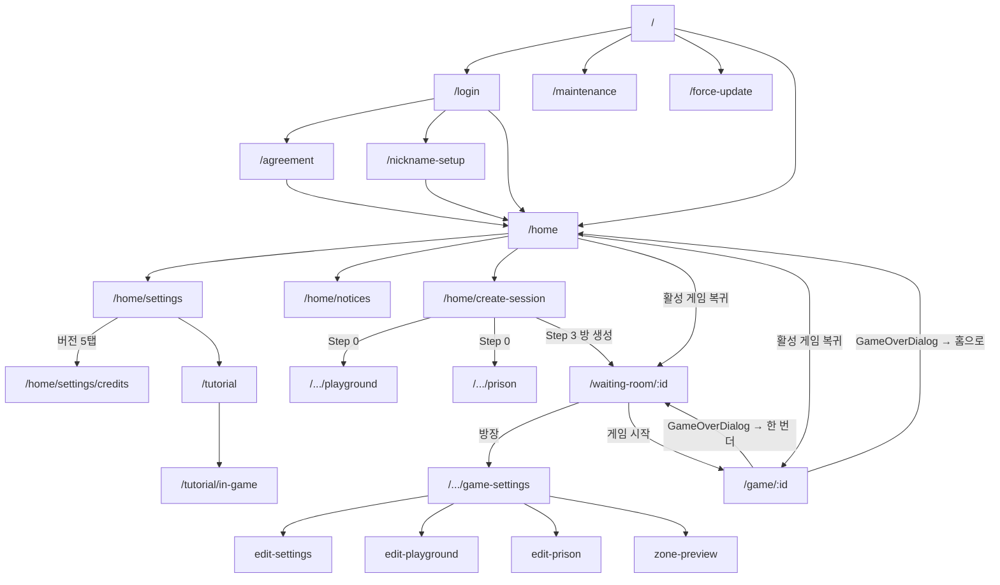

# 경찰과 도둑 - 정보구조도 (Information Architecture)

> **작성일**: 2026-05-14
> **출처**: `lib/router/route_paths.dart`, `lib/router/app_router.dart`, `lib/features/**/presentation/pages/**`
> **범위**: 실제 코드에 등록된 라우트 + 각 화면의 실제 위젯 구조

---

## 1. 전체 라우트 트리 (URL 기반)

```text
/                                                   [Splash]
│  └─ 인증/버전/점검 상태 체크 후 자동 리다이렉트
│
├─ /login                                           [Login]
├─ /onboarding                                      [Onboarding] (placeholder, 미사용)
├─ /agreement                                       [Agreement] (필수 약관 미동의 시)
├─ /nickname-setup?nickname=                        [NicknameSetup] (신규 회원)
│
├─ /home                                            [Home] ★ 메인 허브
│  ├─ /home/settings                                [Settings]
│  │   └─ /home/settings/credits                    [Credits] (앱 버전 5탭 히든 진입)
│  ├─ /home/notices                                 [Notices]
│  └─ /home/create-session                          [SessionCreationFlow] (단일 PageView, 4-step)
│      ├─ /home/create-session/playground           [SetupPlayground]
│      └─ /home/create-session/prison               [SetupPrison]
│
├─ /waiting-room/:sessionId?inviteCode=&showInvite= [WaitingRoom] ★ 대기실
│  └─ /waiting-room/:sessionId/game-settings        [GameSettings] (방장 전용 진입)
│      ├─ /game-settings/edit-settings              [GameSettingsEdit]
│      ├─ /game-settings/edit-playground            [SetupPlayground] (수정 모드)
│      ├─ /game-settings/edit-prison                [SetupPrison] (수정 모드)
│      └─ /game-settings/zone-preview               [ZonePreview] (읽기 전용)
│
├─ /game/:sessionId?team=&pid=&dummy=               [Game] ★ 인게임
│
├─ /tutorial                                        [TutorialCatalog]
│  └─ /tutorial/in-game                             [InGameTutorial]
│
├─ /maintenance                                     [Maintenance]
├─ /force-update                                    [ForceUpdate]
│
└─ /lifecycle-test                                  [LifecycleTest] (kDebugMode 전용)
```

> 게임 종료 결과(F3.4)는 별도 라우트가 아니다. `GamePage` 내부 다이얼로그(`GameOverResultDialog`)로 표시된다.

---

## 2. 리다이렉트 가드 (app_router.dart)

```text
Splash (/) ──┐
              ├─ isLoading             → 보류 (null)
              ├─ 비로그인               → /login  (publicPaths만 예외)
              ├─ requiresAgreement      → /agreement
              ├─ isNewUser              → /nickname-setup?nickname=
              ├─ 로그인 페이지 진입 시
              │    └─ postLoginDestination 있으면 그곳, 없으면 → /home
              └─ /agreement 잔류        → /home

publicPaths = [splash, login, maintenance, force-update, (debug) lifecycle-test]
```

---

## 3. 화면별 실제 위젯 구조

### 3.1 Home (`/home`)

`home_page.dart` 기준 실제 레이아웃.

```text
Scaffold(background=white)
├─ AppBar 없음. SafeArea + Column으로 직접 구성
├─ Top Bar
│   ├─ Text("경찰과도둑")                — heading_20
│   └─ 설정 아이콘 (icon_setting_1.svg)  → context.push('/home/settings')
├─ 중앙 (Expanded)
│   ├─ 우측 정렬 아이콘 2개
│   │   ├─ 공지 (icon_notice.svg)         → context.push('/home/notices')
│   │   └─ Top hat (Top_hat.svg)          → "준비중입니다" 스낵바
│   ├─ SpeechBubble("너무 기대 돼\n이번에는 어떤 역할을 할까?")
│   └─ Image(app_icon.png) 240×240
├─ 하단 버튼 2개
│   ├─ [방 만들기]    → /home/create-session
│   └─ [방 참여하기]  → 초대 코드 입력 다이얼로그 → API → /waiting-room/:id
└─ FAB: kDebugMode일 때만 개발자 메뉴 (Icons.bug_report)
```

**활성 게임 자동 복귀**: `_checkActiveGameAndRedirect()`가 진입 시 1회 실행되어 활성 게임이 있으면 `/waiting-room/:id` 또는 `/game/:id`로 이동.

### 3.2 Settings (`/home/settings`)

`settings_page.dart` 기준.

```text
[계정]
  └─ 닉네임 변경                 → AppDialog (텍스트 입력)

[앱 설정]
  ├─ 게임 알림                   (Switch)
  ├─ 알림                        → AppSettings.openAppSettings(notification)
  └─ 위치 권한 관리              → AppSettings.openAppSettings(location)

[이용 안내]
  ├─ 앱 버전 (v1.x.x)            — 2초 이내 5탭 시 Credits로 (블러+페이드 전환)
  ├─ 버그 제보                   → BugReport 흐름
  ├─ 튜토리얼 다시 보기          → /tutorial
  ├─ 튜토리얼 초기화             → AppDialog
  └─ 이용약관 및 정책            → AgreementSettingsPage (Navigator push)
                                     └─ LegalDocumentPage (Navigator push)

[기타]
  ├─ 로그아웃                    → AppDialog → signOut → /login
  └─ 회원 탈퇴                   → AppDialog → 탈퇴 API → /login?accountDeleted=true
```

### 3.3 Notices (`/home/notices`)

- AppBar: leading = PreviousButton(pop), title = "공지사항"
- Body: 공지 목록 (페이지네이션)

### 3.4 SessionCreationFlow (`/home/create-session`)

단일 페이지에서 PageView로 4단계 진행.

```text
StepIndicator(0/1/2/3)
├─ Step 0: 구역 선택       (Step0SelectAreaContent)
│   ├─ 플레이그라운드 카드 → /home/create-session/playground (지도)
│   └─ 감옥 카드           → /home/create-session/prison     (지도)
├─ Step 1: 인원 설정       (Step1ParticipantSettingsContent)
├─ Step 2: 게임 설정       (Step2GameSettingsContent) — 라운드/공유 주기/경찰 대기 슬라이더
└─ Step 3: 초대 코드 / 방 만들기 (Step3InviteCodeContent)
    └─ [방 생성하기] → API → /waiting-room/:id?inviteCode=&showInvite=true
```

- 뒤로가기: 이전 step. Step 0에서는 이탈 확인 후 `/home`.
- 임시 저장: `SessionDraftStorageService`.

### 3.5 WaitingRoom (`/waiting-room/:sessionId`)

`waiting_room_page.dart` 실제 구조.

```text
Scaffold(background = 도둑이면 black900, 아니면 white)
├─ AppBar (투명)
│   ├─ leading: 나가기 아이콘 (icon_exit.svg) → 이탈 확인 다이얼로그
│   ├─ title:  초대 코드 (밑줄 표시, 탭 시 InviteCodeDialog)
│   └─ actions:
│       ├─ info 아이콘 (icon_info.svg)         → 게임 규칙 다이얼로그
│       └─ 설정 아이콘 (게임 설정 진입)        → context.push('/.../game-settings')
├─ Body (SafeArea + Column)
│   ├─ TeamSection(POLICE)  — 참가자 카드 리스트, 확장/접기
│   ├─ Divider
│   └─ TeamSection(ROBBER)  — 동일 구조
├─ 하단 버튼: _buildBottomButton(isHost, isDark)
│   ├─ 일반 참가자: 준비 / 준비 해제
│   └─ 방장:       (모두 준비됨 + 양 팀 1명 이상) 게임 시작 / 그 외 안내
└─ FAB: kDebugMode일 때만 개발자 메뉴
```

**참가자 카드 인터랙션**:
- 빈 슬롯 탭 (`onAddSlotTap`): 본인이 해당 팀으로 이동
- 방장이 다른 참가자 탭 (`onMemberTap`): `_showKickDialog` (강퇴 확인)
- 본인 카드 탭: 무동작

**중요**: WaitingRoom에는 채팅 오버레이가 **없다**. 채팅은 게임 중에만 노출된다.

**부수 UI**:
- `ReconnectModal` — 재접속 안내 (`showGeneralDialog`, root navigator)
- 진입 시 `showInvite=true` 쿼리 파라미터 있으면 초대 코드 다이얼로그 자동 표시

### 3.6 GameSettings 영역 (방장 전용)

```text
/waiting-room/:id/game-settings              [GameSettingsPage]
├─ edit-settings    [GameSettingsEditPage]    — 라운드/공유 주기 슬라이더 (extra: GameSettingsResponse)
├─ edit-playground  [SetupPlaygroundPage]     — 구역 수정 (extra: lat/lng/radius)
├─ edit-prison      [SetupPrisonPage]         — 감옥 수정
└─ zone-preview     [ZonePreviewPage]         — 두 구역 미리보기 (읽기 전용)
```

- `extra` 누락 진입은 자동 pop (방어 코드 있음).

### 3.7 Game (`/game/:sessionId`)

`game_page.dart` 실제 구조 — `Scaffold(body: Stack)` 기반, AppBar 없음.

```text
Scaffold(resizeToAvoidBottomInset=false)
└─ Stack
    ├─ index 0:  GoogleMapView (full-screen)
    ├─ index 1:  ParticipantOverlay (참가자 모드일 때만 full-screen 오버레이)
    ├─ index 2:  상단 AppBar 영역 (지도 모드일 때만, SafeArea + _buildAppBar)
    ├─ index 3:  PoliceStartCountdown (경찰 대기 카운트다운, 도둑팀 시점)
    ├─ index 4:  MarqueeAlertBanner (체포/탈옥/위치 공개 등 게임 이벤트 알림)
    ├─ index 5:  우측 액션 버튼 컬럼
    │            ├─ [지도 모드]
    │            │   ├─ 참가자 목록 버튼 (icon_person)  — 구역 이탈 중에는 숨김
    │            │   └─ MyLocationButton (내 위치 추적)
    │            └─ [참가자 모드]
    │                ├─ 지도 복귀 (icon_map)
    │                └─ QR 버튼
    │                    ├─ 경찰: icon_qr_scan → QrScannerPage → arrestRobber()
    │                    └─ 도둑: icon_qr_code → QrDisplayDialog (본인 QR)
    ├─ index 6:  ArrestLockOverlay (도둑팀 체포 시) ┐
    │            └─ 내부에 [탈옥 완료] 버튼 → GameActionModal("탈옥") → escape()
    ├─ index 7:  ChatOverlay (DraggableScrollableSheet, 항상 마지막 고정)
    ├─ index 8:  좌측 디버그 FAB (kDebugMode)
    ├─ index 9:  ZoneExitBanner (구역 이탈 슬림 배너, 상단)
    ├─        :  LocationRevealCountdown (다음 위치 공개까지)
    └─        :  ZoneExitVignette (구역 이탈 시 화면 가장자리 비네팅)
```

**상단 AppBar 내용 (`_buildAppBar`)**: 게임 타이머, 위치 공개 카운트다운 등 (역할별 정보).

**체포 흐름**: 경찰이 우측 QR 버튼(참가자 모드 진입 후) → `QrScannerPage` → 도둑 QR 파싱 → 만료/중복 체크 → `arrestRobber()`.

**탈옥 흐름**: 도둑 체포됨 → `ArrestLockOverlay` 전체 잠금 → "탈옥 완료" 버튼 → `GameActionModal` 확인 → `escape()`.

**게임 종료**: `GameOverResultDialog.show()` (별도 라우트 X) → [홈으로] = `/home` / [한 번 더] = `/waiting-room/:id`.

### 3.8 ChatOverlay (Game 전용)

`chat_overlay.dart` — `DraggableScrollableSheet` 기반.

```text
ChatOverlay
├─ Collapsed: 112dp (kChatOverlayCollapsedFixedHeight)
│   └─ 최근 메시지 프리뷰 + 입력바
├─ Snap 50% / 75% (드래그로 확장)
└─ PageView (좌우 스와이프)
    ├─ 전체 채팅 (ALL scope)
    └─ 팀 채팅   (TEAM scope, 본인 팀 한정)
```

확장 시 입력바는 화면 하단 고정.

### 3.9 시스템 화면

| 화면            | 경로            | 트리거                            |
| --------------- | --------------- | ---------------------------------- |
| **Maintenance** | `/maintenance`  | Remote Config 점검 모드            |
| **ForceUpdate** | `/force-update` | 최소 버전 미충족                   |
| **404**         | errorBuilder    | 잘못된 경로 → 로그아웃 + `/login`  |

---

## 4. 다이얼로그 / 모달 / 오버레이 출현 위치

| 컴포넌트                | 출현 위치                  | 트리거                                    |
| ----------------------- | -------------------------- | ----------------------------------------- |
| `AppDialog` / `AppPopup`| 전역 공용                  | 확인/취소 공통                            |
| Join 초대 코드 입력     | Home                       | [방 참여하기]                             |
| Invite 코드 보기        | WaitingRoom                | AppBar title 탭 또는 진입 시 자동         |
| GameRules               | WaitingRoom                | AppBar info 아이콘                        |
| Kick 확인               | WaitingRoom                | 방장이 참가자 카드 탭                     |
| `ReconnectModal`        | WaitingRoom                | 재접속 시                                 |
| `GameActionModal`       | Game (`ArrestLockOverlay`) | "탈옥 완료" 버튼                          |
| `GameOverResultDialog`  | Game                       | GAME_OVER 이벤트                          |
| `QrScannerPage`         | Game (경찰)                | 참가자 모드 → QR 스캔 버튼                |
| `QrDisplayDialog`       | Game (도둑)                | 참가자 모드 → 본인 QR 버튼                |
| `ChatContextMenu`       | Game (ChatOverlay)         | 메시지 길게 누르기                        |
| `MarqueeAlertBanner`    | Game                       | 체포/탈옥/위치 공개 이벤트                |
| `ZoneExitBanner`        | Game                       | 구역 이탈                                 |
| `ZoneExitVignette`      | Game                       | 구역 이탈                                 |
| `ArrestLockOverlay`     | Game                       | 본인이 체포된 상태 (도둑)                 |
| `ParticipantOverlay`    | Game                       | 우측 참가자 목록 버튼 토글                |
| `AppSnackbar`           | 전역                       | 일반 알림 (예: "준비중입니다")            |

---

## 5. Feature 모듈 ↔ 화면 매핑

| Feature           | 주요 책임                       | 진입 화면 / 컴포넌트                                                        |
| ----------------- | ------------------------------- | --------------------------------------------------------------------------- |
| `auth/`           | 로그인·약관·닉네임              | Splash, Login, Agreement, NicknameSetup                                     |
| `session/`        | 세션 생성·대기실·게임 설정      | Home, SessionCreationFlow, WaitingRoom, GameSettings, Setup* , ZonePreview  |
| `game/`           | 인게임 로직·지도·이벤트         | Game, QrScanner, GameOver/Action/QrDisplay 다이얼로그                       |
| `chat/`           | 팀/전체 채팅                    | ChatOverlay (Game **전용**)                                                 |
| `lobby/`          | 대기실 STOMP 이벤트             | WaitingRoom (Provider)                                                      |
| `user/`           | 닉네임 변경·중복 확인           | NicknameSetup, Settings(닉네임 변경)                                        |
| `notice/`         | 공지 조회                       | Notices                                                                     |
| `bug/`            | 버그 제보                       | Settings(이용 안내), 디버그 FAB                                             |
| `settings/`       | 설정·약관 열람                  | Settings, AgreementSettings, LegalDocument                                  |
| `tutorial/`       | 튜토리얼                        | TutorialCatalog, InGameTutorial                                             |
| `credits/`        | 크레딧 (히든)                   | Credits, CreditDetail                                                       |
| `notification/`   | FCM / 로컬 알림                 | 전역 (Provider)                                                             |
| `report/`         | 메시지 신고                     | ChatContextMenu                                                             |

---

## 6. Mermaid 네비게이션 그래프



---

## 7. 검증 메모

- **ChatOverlay 위치**: WaitingRoom에는 사용되지 않음. Game(`game_page.dart` Stack index 7)에만 마운트.
- **Home FAB**: 일반 사용자는 FAB 없음. `kDebugMode`일 때만 개발자 메뉴.
- **WaitingRoom 하단 버튼**: 단일 버튼 (`_buildBottomButton`)이 역할(일반/방장)과 상태(준비/준비해제/시작)에 따라 라벨/동작 결정.
- **체포 진입점**: 경찰의 체포는 우측 액션 버튼이 아니라 "참가자 모드 토글 → QR 버튼" 경로.
- **탈옥 진입점**: 별도 버튼이 아니라 `ArrestLockOverlay` 내부 버튼 (체포된 동안만 노출).
- **게임 종료 UI**: 라우트 없음. `GamePage` 안에서 `GameOverResultDialog.show()`로 모달 표시.
- **활성 게임 자동 복귀**: Home 진입 시 한 번 검사 (`_activeGameChecked` static).
- **Onboarding 페이지**: 라우트 등록되어 있으나 실 코드는 placeholder ("Onboarding" 텍스트만). 실 온보딩은 `agreement`/`nickname-setup`이 분담.
- **세션 생성 슬라이더 범위**: Step 2의 라운드/공유 주기/경찰 대기 정확한 min·max는 `Step2GameSettingsContent` 위젯/PRD 참조 (본 문서에서는 단언하지 않음).

---

**문서 정본 (Source of Truth)**:
- 라우트 정의: `lib/router/route_paths.dart`
- 리다이렉트: `lib/router/app_router.dart`
- 화면 위젯: `lib/features/*/presentation/pages/`
- 게임 Stack 구조: `lib/features/game/presentation/pages/game_page.dart` (1428~)
- 채팅 오버레이: `lib/features/chat/presentation/widgets/chat_overlay.dart`
